# Architecture Design

## Program Structure Visualization

### Program Structure Visualization - Table Format

## 1. Core Programs Overview

| Program Name | Color Code | Primary Purpose | Account Types Managed | Key Responsibilities |
|--------------|------------|-----------------|----------------------|---------------------|
| **Identity Program** | 🔵 Blue | User & Company identity management | UserAccount, CompanyAccount | Account creation, authentication, profile management |
| **Verification Program** | 🟢 Green | KYC/AML processing & compliance | VerificationRequest, ComplianceRecord | Identity verification, status tracking, compliance reporting |
| **Credential Program** | 🟠 Orange | Document & credential management | CredentialAccount, DocumentMetadata | Credential issuance, verification, revocation |
| **Consent Program** | 🟣 Purple | Privacy & permission control | ConsentAccount, AccessLog | Permission management, access control, audit logging |
| **Admin Program** | 🔴 Red | Platform governance & security | AdminAccount, AuditTrail | User management, monitoring, policy enforcement |
| **Integration Program** | 🔷 Cyan | Developer tools & API management | DeveloperAccount, APIKey | App registration, API management, usage tracking |

## 2. Program Instructions Matrix

| Program | Instruction Name | Parameters | Return Type | Description |
|---------|------------------|------------|-------------|-------------|
| **Identity Program** | `create_user_account` | `user_data: UserData, wallet: Pubkey` | `Result<Pubkey>` | Creates new user profile account |
| | `create_company_account` | `company_data: CompanyData, manager: Pubkey` | `Result<Pubkey>` | Creates new company profile account |
| | `authenticate_user` | `user_pubkey: Pubkey, signature: Signature` | `Result<AuthToken>` | Authenticates user with wallet signature |
| | `add_employee` | `company: Pubkey, employee: Pubkey` | `Result<()>` | Adds employee to company account |
| | `remove_employee` | `company: Pubkey, employee: Pubkey` | `Result<()>` | Removes employee from company account |
| | `update_profile_status` | `user: Pubkey, status: AccountStatus` | `Result<()>` | Updates user account status |
| **Verification Program** | `initiate_verification` | `user: Pubkey, verification_type: VerifyType` | `Result<Pubkey>` | Starts verification process |
| | `process_kyc_aml` | `request_id: Pubkey, external_result: VerifyResult` | `Result<()>` | Processes external verification result |
| | `update_verification_status` | `request_id: Pubkey, status: VerifyStatus` | `Result<()>` | Updates verification status |
| | `generate_compliance_report` | `company: Pubkey, period: TimePeriod` | `Result<ComplianceReport>` | Generates compliance dashboard data |
| | `handle_verification_callback` | `request_id: Pubkey, callback_data: CallbackData` | `Result<()>` | Handles external verification callbacks |
| **Credential Program** | `issue_credential` | `user: Pubkey, credential_data: CredentialData` | `Result<Pubkey>` | Issues new credential to user |
| | `verify_credential` | `credential_id: Pubkey, verifier: Pubkey` | `Result<VerifyResult>` | Verifies credential authenticity |
| | `revoke_credential` | `credential_id: Pubkey, reason: String` | `Result<()>` | Revokes existing credential |
| | `update_credential_metadata` | `credential_id: Pubkey, metadata: Metadata` | `Result<()>` | Updates credential metadata |
| | `link_credential_to_profile` | `credential_id: Pubkey, user: Pubkey` | `Result<()>` | Links credential to user profile |
| **Consent Program** | `create_consent_request` | `requester: Pubkey, owner: Pubkey, scope: DataScope` | `Result<Pubkey>` | Creates data access request |
| | `grant_consent` | `request_id: Pubkey, expiry: Option<i64>` | `Result<()>` | Grants permission for data access |
| | `revoke_consent` | `permission_id: Pubkey, reason: String` | `Result<()>` | Revokes existing permission |
| | `check_access_permission` | `accessor: Pubkey, data_owner: Pubkey, data_type: DataType` | `Result<bool>` | Checks if access is permitted |
| | `log_data_access` | `accessor: Pubkey, data_accessed: DataRef, timestamp: i64` | `Result<()>` | Logs data access event |
| **Admin Program** | `suspend_account` | `target: Pubkey, reason: String, duration: Option<i64>` | `Result<()>` | Suspends user or company account |
| | `approve_verifier` | `verifier: Pubkey, verification_types: Vec<VerifyType>` | `Result<()>` | Approves external verification provider |
| | `monitor_platform_activity` | `time_range: TimeRange, activity_type: ActivityType` | `Result<ActivityReport>` | Monitors platform activity |
| | `enforce_compliance_policy` | `policy_id: PolicyId, target: Option<Pubkey>` | `Result<()>` | Enforces compliance policies |
| | `generate_audit_trail` | `entity: Pubkey, time_range: TimeRange` | `Result<AuditTrail>` | Generates audit trail report |
| **Integration Program** | `register_developer_app` | `developer: Pubkey, app_info: AppInfo` | `Result<Pubkey>` | Registers new developer application |
| | `generate_api_key` | `app_id: Pubkey, permissions: Vec<Permission>` | `Result<String>` | Generates API key for application |
| | `track_api_usage` | `api_key_hash: String, endpoint: String, timestamp: i64` | `Result<()>` | Tracks API usage metrics |
| | `handle_webhook` | `app_id: Pubkey, webhook_data: WebhookData` | `Result<()>` | Processes webhook events |
| | `rate_limit_check` | `api_key_hash: String, endpoint: String` | `Result<bool>` | Checks rate limiting status |

## 3. Cross-Program Invocation (CPI) Matrix

| Calling Program | Target Program | CPI Instruction | Trigger Condition | Data Passed |
|-----------------|----------------|-----------------|-------------------|-------------|
| **Identity Program** | **Verification Program** | `invoke_verification_check` | User account creation | `user_pubkey, verification_type` |
| **Identity Program** | **Consent Program** | `request_data_consent` | Employee data access needed | `requester, owner, data_scope` |
| **Verification Program** | **Credential Program** | `issue_verified_credential` | Verification completed successfully | `user_pubkey, verification_result` |
| **Verification Program** | **Admin Program** | `log_verification_event` | Any verification status change | `request_id, event_type, timestamp` |
| **Consent Program** | **Credential Program** | `access_credential_data` | Valid permission exists | `permission_id, credential_ids` |
| **Consent Program** | **Admin Program** | `log_access_event` | Data access occurs | `accessor, owner, data_accessed` |
| **Admin Program** | **Identity Program** | `suspend_user_account` | Policy violation detected | `user_pubkey, violation_type` |
| **Admin Program** | **Credential Program** | `revoke_all_credentials` | Account permanently banned | `user_pubkey, revocation_reason` |
| **Integration Program** | **Identity Program** | `authenticate_api_request` | API call received | `api_key_hash, requested_user` |
| **Integration Program** | **Consent Program** | `check_data_permission` | API data access requested | `app_id, data_owner, data_type` |

## 4. Program Dependencies and Relationships

| Program | Direct Dependencies | Indirect Dependencies | External Dependencies |
|---------|-------------------|----------------------|----------------------|
| **Identity Program** | Verification Program, Consent Program | Credential Program (via Verification) | Solana System Program, SPL Token |
| **Verification Program** | Credential Program, Admin Program | Identity Program (reverse calls) | External KYC/AML APIs, Oracle Programs |
| **Credential Program** | Admin Program | Identity Program, Consent Program | IPFS, Document Verification APIs |
| **Consent Program** | Credential Program, Admin Program | Identity Program | Legal Compliance APIs |
| **Admin Program** | All other programs | External monitoring systems | Compliance Oracle, Legal APIs |
| **Integration Program** | Identity Program, Consent Program | All programs (via monitoring) | Rate Limiting Services, Webhook APIs |

## 5. Program State Management

| Program | State Variables | State Transitions | Persistence Method |
|---------|----------------|-------------------|-------------------|
| **Identity Program** | `user_count`, `company_count`, `active_sessions` | `pending → verified → active → suspended` | Program-owned PDAs |
| **Verification Program** | `pending_requests`, `completed_verifications` | `created → processing → completed/failed` | Verification Request PDAs |
| **Credential Program** | `issued_credentials`, `active_credentials` | `pending → issued → verified → revoked` | Credential Account PDAs |
| **Consent Program** | `active_permissions`, `access_logs` | `requested → granted → accessed → revoked` | Consent Account PDAs |
| **Admin Program** | `platform_metrics`, `audit_events` | `normal → warning → critical → resolved` | Admin Account PDAs |
| **Integration Program** | `registered_apps`, `api_usage_stats` | `registered → active → rate_limited → suspended` | Developer Account PDAs |

## 6. Program Security and Access Control

| Program | Access Control Level | Required Signatures | Rate Limiting | Special Permissions |
|---------|---------------------|-------------------|---------------|-------------------|
| **Identity Program** | User-level | User wallet signature | 10 ops/minute | None |
| **Verification Program** | User + Verifier | User + approved verifier | 5 verifications/hour | Verifier approval required |
| **Credential Program** | User + Issuer | User + credential issuer | 20 ops/minute | Issuer must be verified |
| **Consent Program** | User-controlled | Data owner signature | 50 ops/minute | None |
| **Admin Program** | Admin-only | Admin multi-sig | No limit | Platform admin role required |
| **Integration Program** | Developer + User | Developer + user consent | API-key based | Valid API key required |

## 7. Program Performance Characteristics

| Program | Expected TPS | Account Creation Cost | Typical Instruction Cost | Storage Requirements |
|---------|-------------|----------------------|------------------------|-------------------|
| **Identity Program** | 100-500 | 0.002 SOL | 0.0001 SOL | 500 bytes/account |
| **Verification Program** | 50-200 | 0.003 SOL | 0.0002 SOL | 800 bytes/request |
| **Credential Program** | 200-1000 | 0.0025 SOL | 0.00015 SOL | 600 bytes/credential |
| **Consent Program** | 500-2000 | 0.002 SOL | 0.0001 SOL | 300 bytes/permission |
| **Admin Program** | 10-50 | 0.005 SOL | 0.0003 SOL | 1000 bytes/audit |
| **Integration Program** | 1000-5000 | 0.0015 SOL | 0.00005 SOL | 400 bytes/app |

---

*This table format provides a comprehensive, structured view of the IDenclave program architecture that's easy to reference and understand for both technical and business stakeholders.* 
---------------------------------------------------------

# IDenclave 2.0 - Solana Protocol Architecture Design

## 1. Program Structure Visualization

### Core Program Architecture with Color Coding

```mermaid
graph TB
    subgraph "IDenclave Protocol Suite"
        subgraph "Core Identity Management"
            IP[🔵 Identity Program<br/>• create_user_account<br/>• create_company_account<br/>• authenticate_user<br/>• manage_employees<br/>• update_profile_status]
        end
        
        subgraph "Verification & Compliance"
            VP[🟢 Verification Program<br/>• initiate_verification<br/>• process_kyc_aml<br/>• update_verification_status<br/>• generate_compliance_report<br/>• handle_verification_callback]
        end
        
        subgraph "Credential Management"
            CP[🟠 Credential Program<br/>• issue_credential<br/>• verify_credential<br/>• revoke_credential<br/>• update_credential_metadata<br/>• link_credential_to_profile]
        end
        
        subgraph "Privacy & Consent"
            CNP[🟣 Consent Program<br/>• create_consent_request<br/>• grant_consent<br/>• revoke_consent<br/>• check_access_permission<br/>• log_data_access]
        end
        
        subgraph "Platform Governance"
            AP[🔴 Admin Program<br/>• suspend_account<br/>• approve_verifier<br/>• monitor_platform_activity<br/>• enforce_compliance_policy<br/>• generate_audit_trail]
        end
        
        subgraph "Developer Integration"
            INP[🔷 Integration Program<br/>• register_developer_app<br/>• manage_api_keys<br/>• track_api_usage<br/>• handle_webhooks<br/>• rate_limit_requests]
        end
    end
    
    %% Cross-Program Invocations with Instruction Labels
    IP -->|invoke_verification_check| VP
    VP -->|issue_verified_credential| CP
    IP -->|request_data_consent| CNP
    CNP -->|access_credential_data| CP
    AP -->|suspend_user_account| IP
    AP -->|revoke_all_credentials| CP
    INP -->|authenticate_api_request| IP
    INP -->|check_data_permission| CNP
    VP -->|log_verification_event| AP
    CP -->|log_credential_access| AP
```



## 2. Account Structure Mapping

### Comprehensive Account Architecture with PDAs


## 3. External Dependencies and Integrations

### Integration Architecture with Distinct Shapes

```mermaid
graph TB
    subgraph "IDenclave Core"
        IC[IDenclave Programs]
    end
    
    subgraph "Identity Verification Services"
        KYC1[🔷 Jumio API]
        KYC2[🔷 Onfido API]
        KYC3[🔷 Veriff API]
    end
    
    subgraph "Compliance & Legal"
        AML1[⚖️ Chainalysis API]
        AML2[⚖️ Thomson Reuters]
        LEGAL[⚖️ Legal Entity APIs]
    end
    
    subgraph "Enterprise Systems"
        HR[🏢 HR Systems<br/>Workday, BambooHR]
        CRM[📊 CRM Systems<br/>Salesforce]
        DOC[📝 DocuSign<br/>Document Signing]
    end
    
    subgraph "Storage & Infrastructure"
        IPFS[☁️ IPFS<br/>Document Storage]
        DB[🗄️ PostgreSQL<br/>Metadata Storage]
        CACHE[⚡️ Redis<br/>Session Management]
        S3[☁️ AWS S3<br/>Backup Storage]
    end
    
    subgraph "Communication Services"
        EMAIL[📧 SendGrid<br/>Email Service]
        SMS[📱 Twilio<br/>SMS Service]
        PUSH[📲 Firebase<br/>Push Notifications]
    end
    
    subgraph "Blockchain Infrastructure"
        SOL[⛓️ Solana RPC<br/>Transaction Processing]
        ORACLE[🔮 Chainlink<br/>Price Feeds]
        VALIDATOR[⛓️ Validator Network<br/>Consensus]
    end
    
    %% Integration Connections
    IC --> KYC1
    IC --> KYC2
    IC --> KYC3
    IC --> AML1
    IC --> AML2
    IC --> LEGAL
    IC --> HR
    IC --> CRM
    IC --> DOC
    IC --> IPFS
    IC --> DB
    IC --> CACHE
    IC --> S3
    IC --> EMAIL
    IC --> SMS
    IC --> PUSH
    IC --> SOL
    IC --> ORACLE
    IC --> VALIDATOR
```



## 4. User Interaction Flow with Decision Points

### Complete User Journey Flowchart

```mermaid
flowchart TD
    Start([User Connects Wallet]) --> ValidateWallet{Wallet Valid?}
    ValidateWallet -->|No| WalletError[❌ Wallet Connection Error]
    ValidateWallet -->|Yes| CheckAccount{Account Exists?}
    
    CheckAccount -->|No| UserType{Select User Type}
    CheckAccount -->|Yes| AuthUser[🔐 Authenticate User]
    
    UserType -->|Individual| CreateUser[📝 Create User Account]
    UserType -->|Company| CreateCompany[🏢 Create Company Account]
    UserType -->|Developer| CreateDev[💻 Create Developer Account]
    
    CreateUser --> InitVerification[🔍 Initialize Verification]
    CreateCompany --> SetupEmployees[👥 Setup Employee Management]
    CreateDev --> SetupAPI[🔌 Setup API Access]
    
    InitVerification --> UploadDocs[📤 Upload Documents]
    UploadDocs --> DocValidation{Documents Valid?}
    DocValidation -->|No| RejectDocs[❌ Reject Documents]
    DocValidation -->|Yes| ProcessVerification[⚙️ Process Verification]
    
    ProcessVerification --> ExtVerification[🔍 External Verification Check]
    ExtVerification --> VerificationResult{Verification Success?}
    VerificationResult -->|No| VerificationFailed[❌ Verification Failed]
    VerificationResult -->|Yes| IssueCredential[✅ Issue Credential]
    
    SetupEmployees --> AddEmployee[➕ Add Employee]
    AddEmployee --> RequestEmployeeVerification[📋 Request Employee Verification]
    RequestEmployeeVerification --> ProcessVerification
    
    SetupAPI --> GenerateAPIKey[🔑 Generate API Key]
    GenerateAPIKey --> TestIntegration[🧪 Test Integration]
    
    AuthUser --> UserAction{What Action?}
    UserAction -->|Share Data| ShareFlow[📤 Data Sharing Flow]
    UserAction -->|Manage Credentials| ManageCredentials[📄 Manage Credentials]
    UserAction -->|View Dashboard| ViewDashboard[📊 View Dashboard]
    
    ShareFlow --> DataRequest[📨 Receive Data Request]
    DataRequest --> ReviewRequest[🔍 Review Request Details]
    ReviewRequest --> ConsentDecision{Grant Consent?}
    ConsentDecision -->|No| DenyAccess[❌ Deny Access]
    ConsentDecision -->|Yes| GrantAccess[✅ Grant Access]
    
    GrantAccess --> LogAccess[📝 Log Access Event]
    DenyAccess --> LogDenial[📝 Log Denial Event]
    
    IssueCredential --> CredentialReady[🎉 Credential Ready]
    VerificationFailed --> RetryOption{Retry?}
    RetryOption -->|Yes| UploadDocs
    RetryOption -->|No| End
    
    LogAccess --> End([Process Complete])
    LogDenial --> End
    CredentialReady --> End
    ViewDashboard --> End
    TestIntegration --> End
    WalletError --> End
    RejectDocs --> End
```



## 5. Program Interaction Matrix

### Cross-Program Communication Flow

```mermaid
graph LR
    subgraph "Program Interaction Matrix"
        subgraph "User Registration Flow"
            U[👤 User] --> IP[🔵 Identity Program]
            IP --> VP[🟢 Verification Program]
            VP --> CP[🟠 Credential Program]
            CP --> CNP[🟣 Consent Program]
        end
        
        subgraph "Data Sharing Flow"
            RQ[📨 Request] --> CNP[🟣 Consent Program]
            CNP --> CP[🟠 Credential Program]
            CP --> AP[🔴 Admin Program]
            AP --> LOG[📝 Audit Log]
        end
        
        subgraph "Admin Oversight"
            AP[🔴 Admin Program] --> IP[🔵 Identity Program]
            AP --> CP[🟠 Credential Program]
            AP --> VP[🟢 Verification Program]
            AP --> INP[🔷 Integration Program]
        end
    end
    
    %% Cross-Program Invocation Details
    IP -.->|create_user_account()| VP
    VP -.->|initiate_verification()| CP
    CP -.->|issue_credential()| CNP
    CNP -.->|grant_consent()| AP
    AP -.->|suspend_account()| IP
    AP -.->|revoke_credentials()| CP
    AP -.->|monitor_activity()| VP
    AP -.->|rate_limit()| INP
```

## 6. Account Management with State Transitions

### Account Lifecycle Management


## 7. Security and Access Control Architecture

### Multi-Layer Security Framework

```mermaid
graph TB
    subgraph "Security Layers"
        subgraph "Access Control Matrix"
            ROLES[🎭 User Roles<br/>├─ Individual User<br/>├─ Company Admin<br/>├─ Developer<br/>└─ Platform Admin]
            PERMS[📋 Permissions<br/>├─ Read Own Data<br/>├─ Share Credentials<br/>├─ Manage Employees<br/>└─ System Administration]
        end
        
        subgraph "Security Implementation"
            AUTH[🔐 Authentication Layer<br/>• Wallet Signature Verification<br/>• WebAuthn Support<br/>• Multi-Factor Authentication]
            AUTHZ[🛡️ Authorization Layer<br/>• Role-Based Access Control<br/>• Resource-Level Permissions<br/>• Time-Based Access]
            ENCRYPT[🔒 Encryption Layer<br/>• End-to-End Encryption<br/>• At-Rest Encryption<br/>• Zero-Knowledge Proofs]
            AUDIT[📊 Audit Layer<br/>• Immutable Logging<br/>• Compliance Monitoring<br/>• Real-time Alerts]
        end
    end
    
    ROLES --> AUTH
    PERMS --> AUTHZ
    AUTH --> ENCRYPT
    AUTHZ --> AUDIT
```



## 8. Error Handling and Recovery Paths

### Comprehensive Error Management

```mermaid
flowchart TD
    Start([📥 Incoming Request]) --> Validate{Input Valid?}
    Validate -->|No| ValidationError[🚫 Validation Error<br/>Return 400 Bad Request]
    Validate -->|Yes| Authenticate{Authenticated?}
    Authenticate -->|No| AuthError[🔐 Authentication Error<br/>Return 401 Unauthorized]
    Authenticate -->|Yes| Authorize{Authorized?}
    Authorize -->|No| AuthzError[🛡️ Authorization Error<br/>Return 403 Forbidden]
    Authorize -->|Yes| Process[⚙️ Process Request]
    Process --> Blockchain{Blockchain Transaction}
    Blockchain -->|Success| Success[✅ Success Response]
    Blockchain -->|Failed| Retryable{Retryable?}
    Retryable -->|Yes| RetryQueue[🔄 Add to Retry Queue<br/>⏱️ Exponential Backoff]
    Retryable -->|No| PermanentFailure[💀 Permanent Failure<br/>📝 Log Error<br/>🚨 Alert System]
    Success --> Metrics[📈 Log Success Metrics]
```



## 9. Performance and Scalability Architecture

### Horizontal Scaling Strategy


## 10. Monitoring and Observability

### Comprehensive Monitoring Stack

```mermaid
graph TB
    subgraph "Data Collection"
        APP_METRICS[📊 Application Metrics]
        INFRA_METRICS[🖥️ Infrastructure Metrics]
        BLOCKCHAIN_METRICS[⛓️ Blockchain Metrics]
        USER_ANALYTICS[👥 User Analytics]
        SECURITY_EVENTS[🔒 Security Events]
    end
    
    subgraph "Processing Pipeline"
        METRICS_AGG[📈 Metrics Aggregation]
        LOG_PROCESSING[📄 Log Processing]
        EVENT_CORRELATION[🔗 Event Correlation]
    end
    
    subgraph "Storage & Analysis"
        TS_DB[📈 Time Series DB]
        LOG_STORAGE[📄 Log Storage]
        ANALYTICS_DB[📊 Analytics DB]
    end
    
    subgraph "Visualization & Alerting"
        DASHBOARDS[📊 Real-time Dashboards]
        ALERT_MANAGER[🚨 Alert Manager]
        REPORT_GENERATOR[📋 Report Generator]
    end
    
    APP_METRICS --> METRICS_AGG
    INFRA_METRICS --> METRICS_AGG
    BLOCKCHAIN_METRICS --> METRICS_AGG
    USER_ANALYTICS --> LOG_PROCESSING
    SECURITY_EVENTS --> EVENT_CORRELATION
    METRICS_AGG --> TS_DB
    LOG_PROCESSING --> LOG_STORAGE
    EVENT_CORRELATION --> ANALYTICS_DB
    TS_DB --> DASHBOARDS
    LOG_STORAGE --> ALERT_MANAGER
    ANALYTICS_DB --> REPORT_GENERATOR
```



## 11. Deployment Architecture

### Cloud-Native Deployment Strategy

```mermaid
graph TB
    subgraph "Development"
        DEV[💻 Development Environment]
        LOCAL_TEST[🧪 Local Testing]
    end
    
    subgraph "CI/CD Pipeline"
        REPO[📦 GitHub Repository]
        ACTIONS[⚡ GitHub Actions]
        TESTS[🧪 Automated Tests]
        SECURITY[🔍 Security Scans]
        BUILD[🏗️ Build & Package]
    end
    
    subgraph "Staging Environment"
        K8S_STAGING[☸️ Kubernetes Staging]
        DB_STAGING[🗄️ Staging Database]
        SOLANA_TESTNET[🔗 Solana Testnet]
    end
    
    subgraph "Production Environment"
        K8S_PROD[☸️ Kubernetes Production]
        DB_PROD[🗄️ Production Database]
        SOLANA_MAINNET[🔗 Solana Mainnet]
        MONITORING[📊 Production Monitoring]
    end
    
    DEV --> REPO
    LOCAL_TEST --> REPO
    REPO --> ACTIONS
    ACTIONS --> TESTS
    ACTIONS --> SECURITY
    TESTS --> BUILD
    SECURITY --> BUILD
    BUILD --> K8S_STAGING
    K8S_STAGING --> K8S_PROD
    DB_STAGING --> DB_PROD
    SOLANA_TESTNET --> SOLANA_MAINNET
    K8S_PROD --> MONITORING
```



## Final Architecture Evaluation Checklist

| Requirement | Status | Implementation |
|-------------|--------|----------------|
| **Program Structure Visualization** | ✅ Complete | Color-coded programs with distinct responsibilities |
| **Account Structure Mapping** | ✅ Complete | Comprehensive PDA mapping with derivation patterns |
| **External Dependencies** | ✅ Complete | Distinct shapes for different service types |
| **Program Interactions** | ✅ Complete | CPI flows with labeled instruction names |
| **Decision Points** | ✅ Complete | Flowcharts with diamond decision nodes |
| **Error Handling** | ✅ Complete | Comprehensive error paths and recovery |
| **Clear Labeling** | ✅ Complete | Consistent typography and annotations |
| **Account Type Distinction** | ✅ Complete | Visual differentiation between account types |

This comprehensive architecture design follows all guidelines from the Solana Protocol Architecture Diagram Construction Guide, providing a clear, structured representation of the IDenclave protocol suitable for technical implementation and stakeholder communication. 