# IDenclave 2.0 MVP

A blockchain-based identity verification system built on Solana that empowers individuals with complete control over their digital identities while providing businesses with secure, cost-effective verification services.

## 🏗️ System Architecture


## 🔄 User Journey Flow


## 🔐 Identity Verification Flow


## 📊 Data Flow Architecture


## 🎯 Core Features Flow


## 🔄 API Request Flow


## 🧪 Testing Architecture


## 🚀 Deployment Flow


## 📈 Performance Metrics


## 🔐 Security Architecture


## 🎯 MVP Status Dashboard

```mermaid
graph LR
    subgraph "Core Features"
        A[✅ User Registration]
        B[✅ Document Upload]
        C[✅ Verification System]
        D[✅ Privacy Controls]
    end
    
    subgraph "Technical Status"
        E[✅ Smart Contract Deployed]
        F[✅ API Endpoints Working]
        G[✅ Frontend Functional]
        H[✅ Tests Passing]
    end
    
    subgraph "Production Readiness"
        I[✅ Error Handling]
        J[✅ Security Measures]
        K[✅ Documentation]
        L[✅ Demo Ready]
    end
```



## 🚀 Quick Start

### Prerequisites
- Node.js 18+ 
- Rust 1.70+
- Solana CLI
- Anchor Framework
- PostgreSQL

### Installation

1. **Clone the repository**
```bash
git clone <repository-url>
cd idenclave-2.0
```

2. **Install dependencies**
```bash
npm run install:all
```

3. **Set up environment variables**
```bash
cp env.example .env
# Edit .env with your configuration
```

4. **Configure Program ID**
The smart contract is deployed with Program ID: `Gp1WFWsFF7t84LgrZRv5ALoZsDf7YjRDzrc5FxE3zVUH`
This is already configured in the frontend, but you can verify it in `frontend/src/config/solana.ts`

5. **Start development servers**
```bash
npm run dev
```

The application will be available at:
- Frontend: http://localhost:3000
- Backend API: http://localhost:4000

## 📁 Project Structure

```
idenclave-2.0/
├── frontend/                 # React + TypeScript frontend
│   ├── src/
│   │   ├── components/      # React components
│   │   ├── hooks/          # Custom React hooks
│   │   ├── services/       # API and blockchain services
│   │   └── utils/          # Utility functions
│   └── package.json
├── backend/                 # Node.js + Express backend
│   ├── src/
│   │   ├── routes/         # API routes
│   │   ├── services/       # Business logic
│   │   ├── middleware/     # Express middleware
│   │   └── config/         # Configuration files
│   └── package.json
├── programs/               # Solana smart contracts
│   ├── identity/          # Identity management program
│   ├── verification/      # Verification workflow program
│   ├── consent/          # Consent management program
│   └── Anchor.toml
├── docs/                  # Documentation
├── tests/                 # Integration tests
└── package.json
```

## 🔗 Smart Contract Configuration

### Program ID
- **Deployed Program ID**: `Gp1WFWsFF7t84LgrZRv5ALoZsDf7YjRDzrc5FxE3zVUH`
- **Network**: Solana Devnet
- **Status**: ✅ Deployed and Active
- **Location**: `programs/Anchor.toml` and `programs/src/lib.rs`

### Frontend Integration
The Program ID is configured in `frontend/src/config/solana.ts`:
```typescript
export const SOLANA_CONFIG = {
  PROGRAM_ID: 'Gp1WFWsFF7t84LgrZRv5ALoZsDf7YjRDzrc5FxE3zVUH',
  RPC_ENDPOINT: clusterApiUrl('devnet'),
  NETWORK: 'devnet',
  // ... other config
};
```

## 🏗️ Architecture

### Frontend (React + TypeScript)
- **Framework**: React 18 with TypeScript
- **State Management**: Zustand
- **UI Library**: Tailwind CSS + Headless UI
- **Web3 Integration**: @solana/web3.js + @solana/wallet-adapter
- **HTTP Client**: Axios

### Backend (Node.js + Express)
- **Runtime**: Node.js 18
- **Framework**: Express.js
- **Database**: PostgreSQL with Prisma ORM
- **Authentication**: JWT + wallet signatures
- **File Storage**: IPFS for document storage

### Blockchain (Solana + Anchor)
- **Platform**: Solana Devnet (MVP)
- **Framework**: Anchor
- **Language**: Rust
- **Programs**: Identity, Verification, Consent management
- **Program ID**: `Gp1WFWsFF7t84LgrZRv5ALoZsDf7YjRDzrc5FxE3zVUH`

## 🔧 Core Features

### MVP Features
- ✅ **User Registration**: Create digital identity with Solana wallet
- ✅ **Document Upload**: Securely upload and store credentials
- ✅ **Selective Disclosure**: Control what information to share
- ✅ **Verification Workflow**: Request and process identity verification
- ✅ **Consent Management**: Grant and revoke data access permissions
- ✅ **Business Dashboard**: Manage verification requests and compliance

### Future Features (Phase 2+)
- 🔄 **Zero-Knowledge Proofs**: Advanced privacy features
- 🔄 **Cross-Chain Integration**: Multi-blockchain support
- 🔄 **Enterprise Features**: Advanced compliance and reporting
- 🔄 **Mobile App**: Native mobile application

## 🚀 Development

### Smart Contract Development
```bash
cd programs
anchor build
anchor deploy
```

### Frontend Development
```bash
cd frontend
npm run dev
```

### Backend Development
```bash
cd backend
npm run dev
```

### Database Setup
```bash
cd backend
npx prisma migrate dev
npx prisma generate
```

## 🧪 Testing

### Run All Tests
```bash
npm test
```

### Frontend Tests
```bash
cd frontend
npm test
```

### Backend Tests
```bash
cd backend
npm test
```

### Smart Contract Tests
```bash
cd programs
anchor test
```

## 📊 API Documentation

### Authentication Endpoints
- `POST /api/auth/connect-wallet` - Connect Solana wallet
- `POST /api/auth/verify-signature` - Verify wallet signature

### Identity Endpoints
- `POST /api/identity/create` - Create user identity
- `GET /api/identity/:walletAddress` - Get user profile
- `PUT /api/identity/:walletAddress` - Update user profile

### Credential Endpoints
- `POST /api/credentials/upload` - Upload document
- `GET /api/credentials/:userId` - Get user credentials
- `DELETE /api/credentials/:credentialId` - Revoke credential

### Verification Endpoints
- `POST /api/verification/request` - Create verification request
- `GET /api/verification/:requestId` - Get verification status
- `PUT /api/verification/:requestId` - Update verification status

### Consent Endpoints
- `POST /api/consent/request` - Request data access
- `POST /api/consent/grant` - Grant access permission
- `POST /api/consent/revoke` - Revoke access permission

## 🔐 Security Features

### Privacy Protection
- **End-to-End Encryption**: All sensitive data encrypted
- **Selective Disclosure**: Users control exactly what to share
- **Zero-Knowledge Proofs**: Verify without revealing data
- **Audit Trail**: All access attempts logged on blockchain

### Access Control
- **Wallet-based Authentication**: Secure with private keys
- **Role-based Permissions**: Different access levels
- **Consent Management**: Granular control over data sharing

## 📈 Success Metrics

### Technical Metrics
- User registration completes in <30 seconds
- Document upload processes in <10 seconds
- Verification requests resolve in <60 seconds
- 99% uptime during demo period

### User Experience Metrics
- 90% of users complete registration flow
- 80% of users successfully upload documents
- 70% of verification requests are approved
- Average session duration >5 minutes

## 🤝 Contributing

1. Fork the repository
2. Create a feature branch (`git checkout -b feature/amazing-feature`)
3. Commit your changes (`git commit -m 'Add amazing feature'`)
4. Push to the branch (`git push origin feature/amazing-feature`)
5. Open a Pull Request

## 📄 License

This project is licensed under the MIT License - see the [LICENSE](LICENSE) file for details.

## 📞 Contact

- **Project Lead**: Malika Thaiyab
- **Email**: malikathaiyab023@gmail.com
- **Project**: IDenclave 2.0 - A Decentralized Identity System

## 🙏 Acknowledgments

- Solana Foundation for blockchain infrastructure
- Anchor Framework for smart contract development
- Web3.js team for blockchain integration tools
- React and TypeScript communities for frontend development

---

**IDenclave 2.0** - Empowering individuals with control over their digital identities while providing businesses with secure, efficient verification services.
